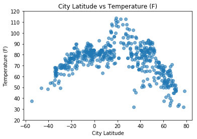
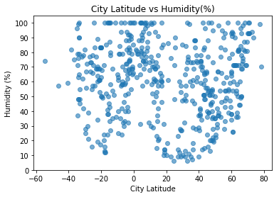
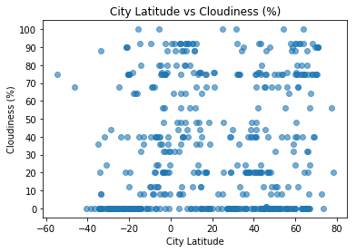
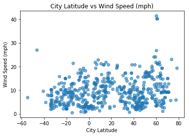

# UNCC HW 6 
# Andrew Kling
## Observable Trends:
#### 1.  There is noticeable  correlation between the latitude of a city and its temperature.  Cities with latitudes between 20-40 degrees North have a higher temperature than anywhere else.  
#### 2. Humidity does not correlate as strongly as temperature but there is a noticable trend at near latitude 0, where the humidity spikes drastically.
#### 3. Wind speed has less correlation as well but also there is a noticable grouping of cities near latitiude 20 North that all have wind speeds grouped near 20 mph.


```python
#Andrew Kling
#UNCC HW#6

import os
import pandas as pd
import matplotlib.pyplot as plt
from citipy import citipy 
import numpy as np
import random
import requests
import json
import openweathermapy.core as owm
from time import sleep

from config import api_key

settings = {"units":"imperial","appid":api_key}
outputFile = "city_weather_data.csv"
```

## Import Cities 


```python
#Create list of 500 cities based on closest location to random lat and lon values selected to be close to land
# 
# Latitudes:  180 Degrees West & 180 Degrees East
# Longitudes: Since the extreme North and South have almost zero inhabitants we will just search 
#             between 80 degrees N and 60 degrees S

cities=[]
countries=[]
latitudes=[]
longitudes=[]
current_city = ""

#get initial city
current_lat = random.randint(-180,180)
current_lon = random.randint(-60,80)
current_city = citipy.nearest_city(current_lat, current_lon)
current_city_name = current_city.city_name
cities.append(current_city_name)
countries.append(current_city.country_code)
latitudes.append(current_lat)
longitudes.append(current_lon)
n=1

#loop over 700 cities.  After experimentation this is enough to allow for the weather API to miss
#some cities and still have over 500 in the final results
for i in range(700):
    #if city is already in list we will keep looping until it is a new city
    while current_city_name in cities:
        current_lat = random.randint(-180,180)
        current_lon = random.randint(-60,80)
        current_city = citipy.nearest_city(current_lat, current_lon)
        current_city_name = current_city.city_name
    n=n+1
    cities.append(current_city_name)
    countries.append(current_city.country_code)
    latitudes.append(current_lat)
    longitudes.append(current_lon)
    
cities_df = pd.DataFrame({"City":cities,
                        "Country":countries,
                        "Latitude":latitudes,
                        "Longitude":longitudes})

cities_df.head()

```


<div>
<style>
    .dataframe thead tr:only-child th {
        text-align: right;
    }

    .dataframe thead th {
        text-align: left;
    }

    .dataframe tbody tr th {
        vertical-align: top;
    }
</style>
<table border="1" class="dataframe">
  <thead>
    <tr style="text-align: right;">
      <th></th>
      <th>City</th>
      <th>Country</th>
      <th>Latitude</th>
      <th>Longitude</th>
    </tr>
  </thead>
  <tbody>
    <tr>
      <th>0</th>
      <td>ponta do sol</td>
      <td>cv</td>
      <td>20</td>
      <td>-30</td>
    </tr>
    <tr>
      <th>1</th>
      <td>ushuaia</td>
      <td>ar</td>
      <td>-174</td>
      <td>-37</td>
    </tr>
    <tr>
      <th>2</th>
      <td>kruisfontein</td>
      <td>za</td>
      <td>-161</td>
      <td>37</td>
    </tr>
    <tr>
      <th>3</th>
      <td>nalut</td>
      <td>ly</td>
      <td>32</td>
      <td>11</td>
    </tr>
    <tr>
      <th>4</th>
      <td>barentsburg</td>
      <td>sj</td>
      <td>175</td>
      <td>-7</td>
    </tr>
  </tbody>
</table>
</div>


## Utilize API to Get City Weather


```python
#Can only make 60 calls per minute...we'll need to slow our requests down! Every 58 calls we sleep for 70 seconds
n=0 # to determine API sleep calls
counter=0 #to display for number of correct city weather pulls
cities_df["Temperature"] = ""
cities_df["Humidity"] = ""
cities_df["Cloudiness"] = ""
cities_df["Wind Speed"] = ""
cities_df["Latitude"] = ""
cities_df["Longitude"] = ""
for index, row in cities_df.iterrows():
    city_country = row["City"] + "," + row["Country"]
    try:
        data = owm.get_current(city_country,**settings)
        print(f'#{counter}: Data for {row["City"]},{row["Country"]} retrieved!')
        cities_df.loc[index, "Temperature"] = float(data["main"]["temp"])
        cities_df.loc[index, "Humidity"] = float(data["main"]["humidity"])
        cities_df.loc[index, "Cloudiness"] = float(data["clouds"]["all"])
        cities_df.loc[index, "Wind Speed"] = float(data["wind"]["speed"])
        cities_df.loc[index, "Latitude"] = float(data["coord"]["lat"])
        cities_df.loc[index, "Longitude"] = float(data["coord"]["lon"])
        n +=1
        counter+=1
        
    except:
        print(f'Could not retrieve {row["City"]},{row["Country"]}')
        #delete row of city we could not retrieve
        cities_df.drop(index, inplace=True)
        n+=1
    
    if n % 58 == 0:
        print("Waiting on API...")
        sleep(70)
        print("Resuming!")


```

    #0: Data for ponta do sol,cv retrieved!
    #1: Data for ushuaia,ar retrieved!
    #2: Data for kruisfontein,za retrieved!
    #3: Data for nalut,ly retrieved!
    Could not retrieve barentsburg,sj
    #4: Data for victoria,sc retrieved!
    Could not retrieve kalomo,zm
    #5: Data for narsaq,gl retrieved!
    #6: Data for longyearbyen,sj retrieved!
    #7: Data for cape town,za retrieved!
    #8: Data for qaanaaq,gl retrieved!
    #9: Data for hermanus,za retrieved!
    #10: Data for nouakchott,mr retrieved!
    #11: Data for bredasdorp,za retrieved!
    #12: Data for port elizabeth,za retrieved!
    Could not retrieve jyvaskyla,fi
    Could not retrieve taolanaro,mg
    #13: Data for tasiilaq,gl retrieved!
    #14: Data for mahebourg,mu retrieved!
    #15: Data for dikson,ru retrieved!
    #16: Data for aksarayskiy,ru retrieved!
    #17: Data for tiznit,ma retrieved!
    #18: Data for port alfred,za retrieved!
    #19: Data for skibbereen,ie retrieved!
    #20: Data for itupiranga,br retrieved!
    #21: Data for igurubi,tz retrieved!
    Could not retrieve belushya guba,ru
    #22: Data for east london,za retrieved!
    #23: Data for husavik,is retrieved!
    Could not retrieve tsienyane,bw
    Could not retrieve illoqqortoormiut,gl
    #24: Data for semey,kz retrieved!
    Could not retrieve elat,il
    #25: Data for georgetown,sh retrieved!
    #26: Data for belmonte,br retrieved!
    #27: Data for strezhevoy,ru retrieved!
    #28: Data for ndele,cf retrieved!
    Could not retrieve skjaerhollen,no
    #29: Data for bambous virieux,mu retrieved!
    Could not retrieve skagastrond,is
    #30: Data for caravelas,br retrieved!
    #31: Data for chuy,uy retrieved!
    Could not retrieve jibuti,dj
    #32: Data for sao filipe,cv retrieved!
    #33: Data for saldanha,za retrieved!
    #34: Data for vikindu,tz retrieved!
    #35: Data for agadez,ne retrieved!
    #36: Data for busselton,au retrieved!
    #37: Data for kavaratti,in retrieved!
    #38: Data for saint-philippe,re retrieved!
    #39: Data for oster,ua retrieved!
    #40: Data for santo antonio do taua,br retrieved!
    #41: Data for luderitz,na retrieved!
    #42: Data for haukipudas,fi retrieved!
    #43: Data for iranshahr,ir retrieved!
    #44: Data for macau,br retrieved!
    #45: Data for ullapool,gb retrieved!
    #46: Data for grand-santi,gf retrieved!
    #47: Data for mehamn,no retrieved!
    #48: Data for albany,au retrieved!
    Could not retrieve codrington,ag
    #49: Data for skjervoy,no retrieved!
    #50: Data for goure,ne retrieved!
    #51: Data for ambovombe,mg retrieved!
    #52: Data for klaksvik,fo retrieved!
    #53: Data for moba,cd retrieved!
    #54: Data for upernavik,gl retrieved!
    #55: Data for malpe,in retrieved!
    #56: Data for hithadhoo,mv retrieved!
    #57: Data for maceio,br retrieved!
    Waiting on API...
    Resuming!
    #58: Data for namibe,ao retrieved!
    #59: Data for aragarcas,br retrieved!
    #60: Data for curuca,br retrieved!
    #61: Data for ponta delgada,pt retrieved!
    #62: Data for aksarka,ru retrieved!
    #63: Data for nuuk,gl retrieved!
    #64: Data for toritama,br retrieved!
    #65: Data for leh,in retrieved!
    Could not retrieve amderma,ru
    #66: Data for toledo,es retrieved!
    #67: Data for souillac,mu retrieved!
    #68: Data for alindao,cf retrieved!
    #69: Data for kidal,ml retrieved!
    #70: Data for beloha,mg retrieved!
    #71: Data for arlit,ne retrieved!
    #72: Data for ilulissat,gl retrieved!
    #73: Data for paamiut,gl retrieved!
    #74: Data for oriximina,br retrieved!
    #75: Data for altamira,br retrieved!
    #76: Data for hofn,is retrieved!
    #77: Data for cap malheureux,mu retrieved!
    Could not retrieve safaga,eg
    #78: Data for jamestown,sh retrieved!
    #79: Data for riyadh,sa retrieved!
    #80: Data for mar del plata,ar retrieved!
    #81: Data for ribeira grande,pt retrieved!
    #82: Data for marawi,sd retrieved!
    #83: Data for savinka,ru retrieved!
    #84: Data for cabedelo,br retrieved!
    #85: Data for dalbandin,pk retrieved!
    Could not retrieve tsihombe,mg
    #86: Data for torbay,ca retrieved!
    #87: Data for santa maria,cv retrieved!
    #88: Data for sorland,no retrieved!
    Could not retrieve kazalinsk,kz
    #89: Data for vestmannaeyjar,is retrieved!
    #90: Data for sinjar,iq retrieved!
    Could not retrieve kemijarvi,fi
    #91: Data for cidreira,br retrieved!
    #92: Data for valladolid,es retrieved!
    #93: Data for hoopstad,za retrieved!
    #94: Data for ostersund,se retrieved!
    #95: Data for kamenka,ru retrieved!
    #96: Data for nyakahanga,tz retrieved!
    Could not retrieve grand river south east,mu
    #97: Data for pitimbu,br retrieved!
    #98: Data for senanga,zm retrieved!
    #99: Data for zerbst,de retrieved!
    #100: Data for iisalmi,fi retrieved!
    #101: Data for tahoua,ne retrieved!
    #102: Data for lalibela,et retrieved!
    #103: Data for grindavik,is retrieved!
    #104: Data for itarema,br retrieved!
    #105: Data for ouadda,cf retrieved!
    #106: Data for arraial do cabo,br retrieved!
    Could not retrieve dubenskiy,ru
    Could not retrieve ituni,gy
    #107: Data for touros,br retrieved!
    #108: Data for oktyabrskoye,ru retrieved!
    #109: Data for kaniama,cd retrieved!
    #110: Data for swinford,ie retrieved!
    #111: Data for rocha,uy retrieved!
    #112: Data for amasya,tr retrieved!
    #113: Data for khorixas,na retrieved!
    #114: Data for glubokiy,ru retrieved!
    #115: Data for bafq,ir retrieved!
    Waiting on API...
    Resuming!
    #116: Data for sarkand,kz retrieved!
    #117: Data for carnarvon,za retrieved!
    #118: Data for mocuba,mz retrieved!
    #119: Data for hwange,zw retrieved!
    #120: Data for uhlove,ua retrieved!
    #121: Data for port-gentil,ga retrieved!
    #122: Data for ambilobe,mg retrieved!
    #123: Data for george,za retrieved!
    #124: Data for kedrovyy,ru retrieved!
    Could not retrieve yirol,sd
    Could not retrieve nioro,ml
    #125: Data for guiratinga,br retrieved!
    #126: Data for amarante do maranhao,br retrieved!
    Could not retrieve olafsvik,is
    #127: Data for maniitsoq,gl retrieved!
    #128: Data for chishtian mandi,pk retrieved!
    #129: Data for dubovka,ru retrieved!
    Could not retrieve umzimvubu,za
    #130: Data for tenenkou,ml retrieved!
    Could not retrieve opobo,ng
    #131: Data for kampene,cd retrieved!
    #132: Data for kyzyl-suu,kg retrieved!
    #133: Data for prieska,za retrieved!
    #134: Data for oistins,bb retrieved!
    #135: Data for ahlat,tr retrieved!
    #136: Data for pangody,ru retrieved!
    Could not retrieve louisbourg,ca
    #137: Data for saint-leu,re retrieved!
    Could not retrieve kapoeta,sd
    #138: Data for pangnirtung,ca retrieved!
    #139: Data for hobyo,so retrieved!
    #140: Data for hit,iq retrieved!
    #141: Data for fagersta,se retrieved!
    #142: Data for tutoia,br retrieved!
    #143: Data for solone,ua retrieved!
    #144: Data for yorosso,ml retrieved!
    #145: Data for aguas formosas,br retrieved!
    #146: Data for sao jose de ribamar,br retrieved!
    Could not retrieve bargal,so
    #147: Data for codroipo,it retrieved!
    #148: Data for glarus,ch retrieved!
    #149: Data for ayorou,ne retrieved!
    #150: Data for santa comba,es retrieved!
    #151: Data for necochea,ar retrieved!
    #152: Data for zhanaozen,kz retrieved!
    #153: Data for aleksandrov gay,ru retrieved!
    #154: Data for gamba,ga retrieved!
    #155: Data for bathsheba,bb retrieved!
    #156: Data for saint-francois,gp retrieved!
    #157: Data for pindi gheb,pk retrieved!
    #158: Data for san pedro,ar retrieved!
    #159: Data for hvide sande,dk retrieved!
    #160: Data for sisimiut,gl retrieved!
    #161: Data for maragogi,br retrieved!
    #162: Data for imeni morozova,ru retrieved!
    #163: Data for vila velha,br retrieved!
    #164: Data for peruibe,br retrieved!
    Could not retrieve tall kayf,iq
    #165: Data for morondava,mg retrieved!
    #166: Data for povarovo,ru retrieved!
    #167: Data for sur,om retrieved!
    Could not retrieve laguna,br
    #168: Data for asyut,eg retrieved!
    #169: Data for porto novo,cv retrieved!
    Could not retrieve stamsund,no
    #170: Data for djambala,cg retrieved!
    #171: Data for owando,cg retrieved!
    #172: Data for salvador,br retrieved!
    #173: Data for dunkwa,gh retrieved!
    Waiting on API...
    Resuming!
    #174: Data for barreiras,br retrieved!
    #175: Data for vardo,no retrieved!
    #176: Data for henties bay,na retrieved!
    #177: Data for manavalakurichi,in retrieved!
    #178: Data for sao joao da barra,br retrieved!
    #179: Data for boende,cd retrieved!
    #180: Data for marsa matruh,eg retrieved!
    #181: Data for azul,ar retrieved!
    #182: Data for saint-joseph,re retrieved!
    #183: Data for luanda,ao retrieved!
    Could not retrieve faya,td
    #184: Data for capao bonito,br retrieved!
    #185: Data for sao jose da coroa grande,br retrieved!
    #186: Data for chipinge,zw retrieved!
    #187: Data for qaqortoq,gl retrieved!
    Could not retrieve sorvag,fo
    #188: Data for pelym,ru retrieved!
    #189: Data for marovoay,mg retrieved!
    Could not retrieve toliary,mg
    #190: Data for santo antonio do sudoeste,br retrieved!
    #191: Data for likasi,cd retrieved!
    #192: Data for takoradi,gh retrieved!
    #193: Data for sabha,ly retrieved!
    #194: Data for gornopravdinsk,ru retrieved!
    #195: Data for umea,se retrieved!
    #196: Data for nanortalik,gl retrieved!
    #197: Data for benghazi,ly retrieved!
    Could not retrieve gat,ly
    #198: Data for luangwa,zm retrieved!
    #199: Data for kembe,cf retrieved!
    #200: Data for bonavista,ca retrieved!
    #201: Data for kutum,sd retrieved!
    Could not retrieve saryshagan,kz
    #202: Data for manturovo,ru retrieved!
    #203: Data for cervo,es retrieved!
    #204: Data for yeroham,il retrieved!
    #205: Data for novopokrovka,ru retrieved!
    #206: Data for castrillon,es retrieved!
    #207: Data for dasoguz,tm retrieved!
    #208: Data for ahar,ir retrieved!
    #209: Data for adrar,dz retrieved!
    #210: Data for camacha,pt retrieved!
    #211: Data for canico,pt retrieved!
    #212: Data for berlevag,no retrieved!
    #213: Data for sambava,mg retrieved!
    #214: Data for muros,es retrieved!
    #215: Data for puteyets,ru retrieved!
    #216: Data for zabid,ye retrieved!
    #217: Data for qasigiannguit,gl retrieved!
    #218: Data for esfahan,ir retrieved!
    #219: Data for diamantino,br retrieved!
    Could not retrieve tarudant,ma
    #220: Data for fushe-arrez,al retrieved!
    #221: Data for agua branca,br retrieved!
    #222: Data for umm kaddadah,sd retrieved!
    #223: Data for astaneh-ye ashrafiyeh,ir retrieved!
    Could not retrieve dahuk,iq
    Could not retrieve karakendzha,tj
    #224: Data for am timan,td retrieved!
    #225: Data for pitsunda,ge retrieved!
    #226: Data for cerrito,py retrieved!
    Could not retrieve mananara,mg
    #227: Data for nara,ml retrieved!
    #228: Data for monrovia,lr retrieved!
    #229: Data for hun,ly retrieved!
    #230: Data for mizan teferi,et retrieved!
    Could not retrieve ketchenery,ru
    #231: Data for damghan,ir retrieved!
    Waiting on API...
    Resuming!
    #232: Data for emborion,gr retrieved!
    #233: Data for lugovoy,ru retrieved!
    #234: Data for viedma,ar retrieved!
    Could not retrieve tukrah,ly
    #235: Data for karaj,ir retrieved!
    #236: Data for salalah,om retrieved!
    #237: Data for adre,td retrieved!
    #238: Data for cayenne,gf retrieved!
    #239: Data for morros,br retrieved!
    #240: Data for taoudenni,ml retrieved!
    #241: Data for aguai,br retrieved!
    #242: Data for richards bay,za retrieved!
    #243: Data for yar-sale,ru retrieved!
    #244: Data for malkara,tr retrieved!
    #245: Data for margate,za retrieved!
    Could not retrieve viligili,mv
    #246: Data for wageningen,sr retrieved!
    #247: Data for mananjary,mg retrieved!
    #248: Data for grand gaube,mu retrieved!
    #249: Data for bafia,cm retrieved!
    #250: Data for medvedka,ru retrieved!
    #251: Data for upington,za retrieved!
    #252: Data for nikel,ru retrieved!
    #253: Data for saint george,bm retrieved!
    Could not retrieve sedelnikovo,ru
    #254: Data for ilheus,br retrieved!
    #255: Data for samara,ru retrieved!
    #256: Data for araguaina,br retrieved!
    #257: Data for inhambane,mz retrieved!
    #258: Data for montanha,br retrieved!
    #259: Data for linkoping,se retrieved!
    #260: Data for ostrovnoy,ru retrieved!
    Could not retrieve doha,kw
    #261: Data for kjopsvik,no retrieved!
    Could not retrieve kunya,ru
    #262: Data for karur,in retrieved!
    #263: Data for millau,fr retrieved!
    #264: Data for koster,za retrieved!
    #265: Data for quimper,fr retrieved!
    #266: Data for ilinskiy,ru retrieved!
    #267: Data for urambo,tz retrieved!
    Could not retrieve solovetskiy,ru
    #268: Data for udimskiy,ru retrieved!
    #269: Data for nacala,mz retrieved!
    #270: Data for malindi,ke retrieved!
    #271: Data for oum hadjer,td retrieved!
    #272: Data for itarantim,br retrieved!
    #273: Data for odienne,ci retrieved!
    #274: Data for mabaruma,gy retrieved!
    #275: Data for miandrivazo,mg retrieved!
    #276: Data for praia da vitoria,pt retrieved!
    #277: Data for makat,kz retrieved!
    Could not retrieve tasbuget,kz
    #278: Data for irtyshskiy,ru retrieved!
    #279: Data for berkak,no retrieved!
    #280: Data for dingle,ie retrieved!
    Could not retrieve maarianhamina,fi
    #281: Data for borba,br retrieved!
    #282: Data for thinadhoo,mv retrieved!
    #283: Data for idah,ng retrieved!
    Could not retrieve bjala,bg
    #284: Data for kirchzarten,de retrieved!
    Could not retrieve podor,sn
    #285: Data for jizan,sa retrieved!
    #286: Data for rundu,na retrieved!
    #287: Data for saint-denis,re retrieved!
    #288: Data for bardiyah,ly retrieved!
    #289: Data for amapa,br retrieved!
    Waiting on API...
    Resuming!
    #290: Data for kanjiza,rs retrieved!
    #291: Data for chabahar,ir retrieved!
    #292: Data for san lawrenz,mt retrieved!
    Could not retrieve inderborskiy,kz
    #293: Data for lowicz,pl retrieved!
    #294: Data for bechem,gh retrieved!
    #295: Data for sertanopolis,br retrieved!
    #296: Data for tabou,ci retrieved!
    #297: Data for santa vitoria do palmar,br retrieved!
    Could not retrieve tumannyy,ru
    #298: Data for lucapa,ao retrieved!
    #299: Data for grakhovo,ru retrieved!
    Could not retrieve wexford,ie
    #300: Data for fort-shevchenko,kz retrieved!
    #301: Data for przasnysz,pl retrieved!
    Could not retrieve bereda,so
    #302: Data for dwarka,in retrieved!
    #303: Data for ordu,tr retrieved!
    #304: Data for toktogul,kg retrieved!
    #305: Data for touzim,cz retrieved!
    #306: Data for umm lajj,sa retrieved!
    #307: Data for tabory,ru retrieved!
    #308: Data for carros,fr retrieved!
    #309: Data for eenhana,na retrieved!
    #310: Data for tshikapa,cd retrieved!
    #311: Data for zhirnovsk,ru retrieved!
    #312: Data for antalaha,mg retrieved!
    #313: Data for roald,no retrieved!
    #314: Data for amudat,ug retrieved!
    #315: Data for lambarene,ga retrieved!
    #316: Data for kindu,cd retrieved!
    #317: Data for sabya,sa retrieved!
    #318: Data for bejar,es retrieved!
    #319: Data for nampula,mz retrieved!
    Could not retrieve birin,dz
    #320: Data for atbasar,kz retrieved!
    #321: Data for lagoa,pt retrieved!
    #322: Data for alta floresta,br retrieved!
    #323: Data for koygorodok,ru retrieved!
    #324: Data for greytown,za retrieved!
    #325: Data for tromso,no retrieved!
    #326: Data for beyneu,kz retrieved!
    Could not retrieve tucuma,br
    #327: Data for kristiansund,no retrieved!
    #328: Data for nevel,ru retrieved!
    #329: Data for los llanos de aridane,es retrieved!
    #330: Data for shubarshi,kz retrieved!
    #331: Data for bida,ng retrieved!
    #332: Data for wamba,cd retrieved!
    Could not retrieve mutsamudu,km
    #333: Data for karpogory,ru retrieved!
    #334: Data for natal,br retrieved!
    #335: Data for tshela,cd retrieved!
    #336: Data for kaduy,ru retrieved!
    #337: Data for were ilu,et retrieved!
    #338: Data for liwale,tz retrieved!
    Could not retrieve goderich,sl
    #339: Data for balsas,br retrieved!
    #340: Data for eyl,so retrieved!
    #341: Data for vila franca do campo,pt retrieved!
    #342: Data for pentecoste,br retrieved!
    #343: Data for lenine,ua retrieved!
    Could not retrieve hunza,pk
    #344: Data for bilma,ne retrieved!
    #345: Data for panjab,af retrieved!
    Could not retrieve emba,kz
    #346: Data for canchungo,gw retrieved!
    #347: Data for oksfjord,no retrieved!
    Waiting on API...
    Resuming!
    Could not retrieve aras,no
    Waiting on API...
    Resuming!
    #348: Data for nizhniy ufaley,ru retrieved!
    #349: Data for gravdal,no retrieved!
    #350: Data for sumbe,ao retrieved!
    #351: Data for kannangad,in retrieved!
    Could not retrieve saint anthony,ca
    #352: Data for vyshestebliyevskaya,ru retrieved!
    #353: Data for nador,ma retrieved!
    Could not retrieve san carlos,py
    #354: Data for havoysund,no retrieved!
    #355: Data for kirovskaya,ru retrieved!
    #356: Data for filingue,ne retrieved!
    #357: Data for kapustin yar,ru retrieved!
    #358: Data for minervino murge,it retrieved!
    #359: Data for christiana,za retrieved!
    #360: Data for bandundu,cd retrieved!
    Could not retrieve warqla,dz
    #361: Data for bonthe,sl retrieved!
    #362: Data for zahnitkiv,ua retrieved!
    #363: Data for saurimo,ao retrieved!
    Could not retrieve saint-georges,gf
    #364: Data for harper,lr retrieved!
    #365: Data for buta,cd retrieved!
    #366: Data for muravlenko,ru retrieved!
    #367: Data for teguise,es retrieved!
    #368: Data for nortelandia,br retrieved!
    #369: Data for petrivka,ua retrieved!
    #370: Data for ujhani,in retrieved!
    #371: Data for usinsk,ru retrieved!
    #372: Data for zhob,pk retrieved!
    #373: Data for mozarlandia,br retrieved!
    Could not retrieve indija,rs
    #374: Data for darnah,ly retrieved!
    #375: Data for buciumi,ro retrieved!
    #376: Data for aksu,cn retrieved!
    #377: Data for tazovskiy,ru retrieved!
    #378: Data for argentan,fr retrieved!
    #379: Data for viseu,br retrieved!
    #380: Data for kabalo,cd retrieved!
    #381: Data for omboue,ga retrieved!
    #382: Data for amalner,in retrieved!
    #383: Data for olinda,br retrieved!
    Could not retrieve kristiinankaupunki,fi
    #384: Data for aktau,kz retrieved!
    #385: Data for chany,ru retrieved!
    #386: Data for robertsport,lr retrieved!
    #387: Data for saint-augustin,ca retrieved!
    #388: Data for praia,cv retrieved!
    #389: Data for gobabis,na retrieved!
    Could not retrieve barawe,so
    #390: Data for chitipa,mw retrieved!
    #391: Data for mahajanga,mg retrieved!
    #392: Data for bosaso,so retrieved!
    #393: Data for lyuban,ru retrieved!
    #394: Data for araxa,br retrieved!
    #395: Data for buchanan,lr retrieved!
    #396: Data for nouadhibou,mr retrieved!
    #397: Data for pennagaram,in retrieved!
    #398: Data for burriana,es retrieved!
    #399: Data for harer,et retrieved!
    #400: Data for kuldiga,lv retrieved!
    #401: Data for itaqui,br retrieved!
    #402: Data for araouane,ml retrieved!
    #403: Data for mandera,ke retrieved!
    Could not retrieve abu samrah,qa
    #404: Data for krasnovishersk,ru retrieved!
    Could not retrieve bolsheustikinskoye,ru
    Could not retrieve grajau,br
    Could not retrieve scottsburgh,za
    #405: Data for severnoye,ru retrieved!
    Waiting on API...
    Resuming!
    #406: Data for ormara,pk retrieved!
    #407: Data for nkayi,cg retrieved!
    #408: Data for lubango,ao retrieved!
    #409: Data for lodja,cd retrieved!
    #410: Data for valdobbiadene,it retrieved!
    #411: Data for dhidhdhoo,mv retrieved!
    #412: Data for ust-tsilma,ru retrieved!
    #413: Data for kontagora,ng retrieved!
    #414: Data for mayumba,ga retrieved!
    #415: Data for vitre,fr retrieved!
    #416: Data for basoko,cd retrieved!
    Could not retrieve maykain,kz
    #417: Data for staryy krym,ua retrieved!
    #418: Data for quatre cocos,mu retrieved!
    #419: Data for pompeu,br retrieved!
    #420: Data for aran,az retrieved!
    #421: Data for kirkwood,za retrieved!
    #422: Data for rabo de peixe,pt retrieved!
    #423: Data for chitral,pk retrieved!
    #424: Data for ayagoz,kz retrieved!
    #425: Data for yelan,ru retrieved!
    #426: Data for kamyaran,ir retrieved!
    #427: Data for umba,ru retrieved!
    Could not retrieve wahran,dz
    #428: Data for sembe,cg retrieved!
    #429: Data for ask,no retrieved!
    #430: Data for tessalit,ml retrieved!
    #431: Data for abonnema,ng retrieved!
    #432: Data for kilindoni,tz retrieved!
    Could not retrieve blonduos,is
    #433: Data for mathathane,bw retrieved!
    #434: Data for jalu,ly retrieved!
    #435: Data for landsberg,de retrieved!
    Could not retrieve umm durman,sd
    #436: Data for zalaszentgrot,hu retrieved!
    #437: Data for kadoma,zw retrieved!
    #438: Data for mega,et retrieved!
    #439: Data for medea,dz retrieved!
    Could not retrieve navabad,tj
    #440: Data for ila,ng retrieved!
    #441: Data for asuncion,py retrieved!
    #442: Data for jiwani,pk retrieved!
    #443: Data for wadi,in retrieved!
    Could not retrieve andevoranto,mg
    Could not retrieve yakshur-bodya,ru
    #444: Data for opuwo,na retrieved!
    #445: Data for lastoursville,ga retrieved!
    #446: Data for leskovac,rs retrieved!
    Could not retrieve cazaje,ao
    #447: Data for bahir dar,et retrieved!
    Could not retrieve rostaq,af
    Could not retrieve hvolsvollur,is
    #448: Data for talwara,in retrieved!
    #449: Data for rio grande,br retrieved!
    #450: Data for sikonge,tz retrieved!
    #451: Data for sabzevar,ir retrieved!
    #452: Data for labytnangi,ru retrieved!
    #453: Data for nola,cf retrieved!
    #454: Data for alexandria,eg retrieved!
    Could not retrieve asfi,ma
    #455: Data for jega,ng retrieved!
    #456: Data for norrtalje,se retrieved!
    #457: Data for arandis,na retrieved!
    #458: Data for funtua,ng retrieved!
    #459: Data for navahrudak,by retrieved!
    #460: Data for atar,mr retrieved!
    #461: Data for erdemli,tr retrieved!
    #462: Data for anloga,gh retrieved!
    Could not retrieve juba,sd
    #463: Data for brumunddal,no retrieved!
    Waiting on API...
    Resuming!
    Could not retrieve duz,tn
    Waiting on API...
    Resuming!
    #464: Data for oloron-sainte-marie,fr retrieved!
    #465: Data for harlingen,nl retrieved!
    #466: Data for sosva,ru retrieved!
    #467: Data for diofior,sn retrieved!
    #468: Data for llanes,es retrieved!
    Could not retrieve yefira,gr
    #469: Data for petauke,zm retrieved!
    #470: Data for kotido,ug retrieved!
    #471: Data for muhos,fi retrieved!
    #472: Data for cerrik,al retrieved!
    #473: Data for makushino,ru retrieved!
    #474: Data for barreirinha,br retrieved!
    #475: Data for korhogo,ci retrieved!
    #476: Data for plettenberg bay,za retrieved!
    #477: Data for tazmalt,dz retrieved!
    #478: Data for gaspar,br retrieved!
    #479: Data for dalvik,is retrieved!
    #480: Data for bajil,ye retrieved!
    #481: Data for galashki,ru retrieved!
    #482: Data for seligenstadt,de retrieved!
    #483: Data for mahibadhoo,mv retrieved!
    #484: Data for ushtobe,kz retrieved!
    #485: Data for rafina,gr retrieved!
    #486: Data for lapua,fi retrieved!
    #487: Data for at-bashi,kg retrieved!
    #488: Data for torva,ee retrieved!
    Could not retrieve bolshiye uki,ru
    #489: Data for shache,cn retrieved!
    #490: Data for schruns,at retrieved!
    Could not retrieve zlatarica,bg
    #491: Data for biltine,td retrieved!
    Could not retrieve orgun,af
    #492: Data for lukovetskiy,ru retrieved!
    #493: Data for manjacaze,mz retrieved!
    #494: Data for saint-medard-en-jalles,fr retrieved!
    #495: Data for romitan,uz retrieved!
    #496: Data for manaus,br retrieved!
    #497: Data for bataipora,br retrieved!
    #498: Data for trabzon,tr retrieved!
    #499: Data for uporovo,ru retrieved!
    #500: Data for thaba-tseka,ls retrieved!
    #501: Data for peresichna,ua retrieved!
    Could not retrieve bur gabo,so
    #502: Data for ruswil,ch retrieved!
    #503: Data for tyup,kg retrieved!
    #504: Data for rudbar,af retrieved!
    #505: Data for calvinia,za retrieved!
    #506: Data for ondangwa,na retrieved!
    #507: Data for itaituba,br retrieved!
    #508: Data for sinnamary,gf retrieved!
    Could not retrieve raga,sd
    


```python
#reset index of dataframe after dropping empty rows
cities_df = cities_df.reset_index(drop=True)

```

## City Latitude vs Temperature (F)


```python
#city longitude vs temp plot
plt.scatter(cities_df["Latitude"],cities_df["Temperature"], alpha=.6)
plt.title("City Latitude vs Temperature (F)")
plt.xlabel("City Latitude")
plt.ylabel("Temperature (F)")
plt.xticks(np.arange(-60,100,20))
plt.yticks(np.arange(20,130,10))
plt.savefig("lat_vs_temp.png")
plt.show()

```





## City Latitude vs Humidity (%)


```python
plt.scatter(cities_df["Latitude"],cities_df["Humidity"], alpha=.6)
plt.title("City Latitude vs Humidity(%)")
plt.xlabel("City Latitude")
plt.ylabel("Humidity (%)")
plt.xticks(np.arange(-60,100,20))
plt.yticks(np.arange(0,110,10))
plt.savefig("lat_vs_humidity.png")
plt.show()
```





## City Latitude vs Cloudiness (%)


```python
plt.scatter(cities_df["Latitude"],cities_df["Cloudiness"], alpha=.6)
plt.title("City Latitude vs Cloudiness (%)")
plt.xlabel("City Latitude")
plt.ylabel("Cloudiness (%)")
plt.xticks(np.arange(-60,100,20))
plt.yticks(np.arange(0,110,10))
plt.savefig("lat_vs_cloudiness.png")
plt.show()
```





## City Latitude vs Wind Speed (mph)


```python
plt.scatter(cities_df["Latitude"],cities_df["Wind Speed"], alpha=.6)
plt.title("City Latitude vs Wind Speed (mph)")
plt.xlabel("City Latitude")
plt.ylabel("Wind Speed (mph)")
plt.xticks(np.arange(-60,100,20))
plt.yticks(np.arange(0,50,10))
plt.savefig("lat_vs_wind_speed.png")
plt.show()
```




